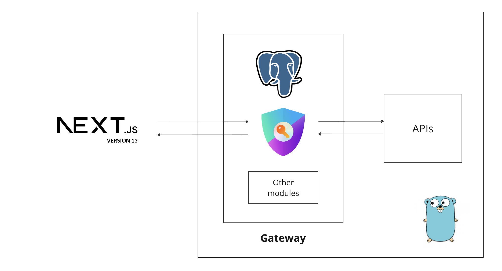
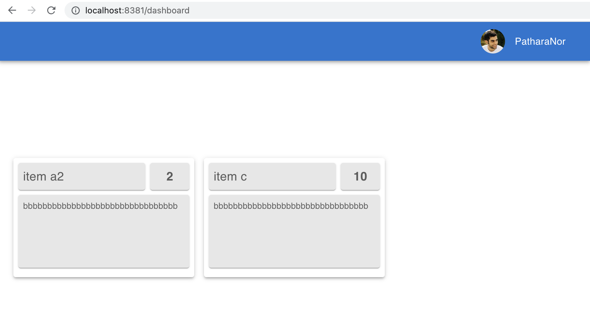

# **Secure Voting System**



## **Features**

- [API Gateway](./docs/gateway.md)
- [Authentication/Authorization](./docs/authorization.md)
- [Database](./docs/database.md)
- [Voting APIs](./docs/api.md)
- [Web Application](./docs/web-app.md)


## **Usage**

### **Start services**

The service, including :

- API Gateway — available on port `9323`/`1323` (public/private).
- Voting APIs — available on port `1323` (private only).
- Web application — available on port `8381`/`3001` (public/private).

```sh
docker-compose -f docker-compose.dev.yml down -v && \
docker-compose -f docker-compose.dev.yml up --build
```

Let's :

- Signup : http://localhost:8381/signup
- Signin : http://localhost:8381/login
- Adding vote item — this part please using `curl` command to add the item, please refer to calling step of my [APIs](./docs/api.md).



> ---
> Admin role:
> - To generate admin account, please run `curl` command below :
>
> ```sh
> curl --location 'http://localhost:9323/signup' \
> --header 'Content-Type: application/json' \
> --data '{
>     "username": "PatharaNor",
>     "password": "1234567890",
>     "isAdmin": true
> }'
> ```
> ---

### **Calling APIs**

> ---
>
> Ref. [Postman collection](./examples/postman/secure-voting-system.postman_collection.json).
>
> ---

***User Account & Voting APIs***

More detail [here](./docs/api.md).

## **Web**

More detail [here](./docs/web-app.md).

## **Todo**

More detail [here](./docs/todo.md).