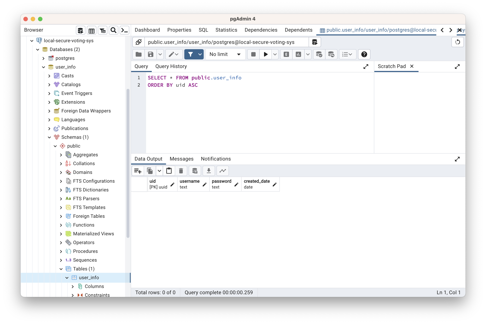

# **PostgreSQL**

## **Postgres's Extension**

We using 2-features from `Postgres` :

- `uuid_generate_v4()` to generate UUID in specific column.
- `crypt()` to encrypt password which are recorded into database.

But before using any features of `Postgres`, please create extension first. You can declare SQL statement below into `*.sql` file.

```sql
-- create uuid
CREATE EXTENSION IF NOT EXISTS "uuid-ossp";

-- encrypt password
CREATE EXTENSION IF NOT EXISTS "pgcrypto";
```

then :

- In case you using `docker-compose`, adding it into `/docker-entrypoint-initdb.d`.
- On top of some platform, just run `*.sql`.

## **Generate UUID**

In this case, I plan to use UUID to be user ID. It will be generated immediately after new account created/recorded. You can declare SQL like this :

```sql
-- user info table
CREATE TABLE IF NOT EXISTS user_info
(
    uid uuid DEFAULT uuid_generate_v4(),
    username TEXT NOT NULL UNIQUE,
    password TEXT NOT NULL,
    is_admin BOOLEAN DEFAULT FALSE,
    created_at TIMESTAMP DEFAULT NOW(),
    updated_at TIMESTAMP DEFAULT NOW(),
    CONSTRAINT user_info_pkey PRIMARY KEY (uid)
);
```

## **Encrypt Password**

`gen_salt` Generates a new random salt string for use in crypt(). The salt string also tells crypt() which algorithm to use.

The type parameter specifies the hashing algorithm. The accepted types are: des, xdes, md5 and bf.

```golang
// ...
var lastInsertId int
err := p.db.QueryRow(
    "INSERT INTO user_info(username, password) VALUES( $1, crypt($2, gen_salt('bf')) ) returning uid;",
    usr, pwd,
).Scan(&lastInsertId)

return lastInsertId, err
```

## **Contribute**

### **Data initialization**

Normally `docker-compose.dev.yml` file, make initial table and setup extension which required in this service, please refer to  `./common/init.sql`. The `*.sql` file will be executed in `/docker-entrypoint-initdb.d` of the `postgres` container image :

```yml
# ...

    db:
        container_name: db
        image: postgres
        # ...
        volumes:
        - ./common/init.sql:/docker-entrypoint-initdb.d/init.sql

# ...
```




In case database didn't create (or initial) correctly, please removing `pgdata` directory then re-run command below again :

```sh
sh run.dev.sh
```
